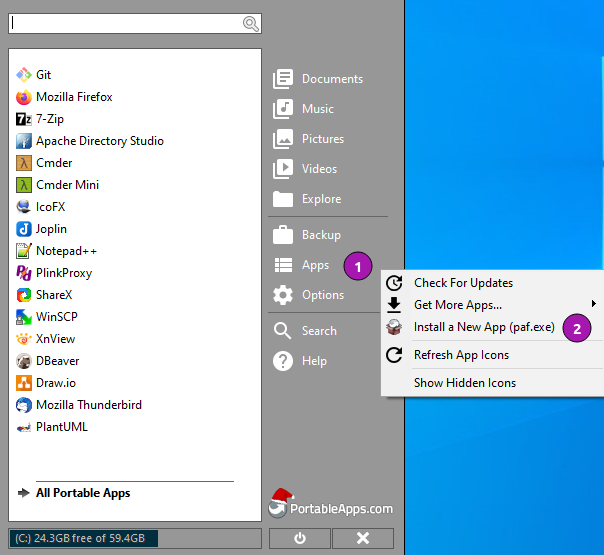

[]({{ AppProjectUrl }}/actions?query=workflow%3Abuild-package)
[]({{ AppProjectUrl }}/releases)
[](#runtime-dependencies)


# {{ AppNameSpaced }} for PortableApps.com


[{{ UpstreamName }}]({{ UpstreamUrl }}) Lorem ipsum dolor sit amet, consetetur
sadipscing elitr, sed diam nonumy eirmod tempor invidunt ut labore et dolore
magna aliquyam erat, sed diam voluptua. At vero eos et accusam et justo duo
dolores et ea rebum.

Stet clita kasd gubergren, no sea takimata sanctus est Lorem ipsum dolor sit
amet. Lorem ipsum dolor sit amet, consetetur sadipscing elitr, sed diam
nonumy eirmod tempor invidunt ut labore et dolore magna aliquyam erat, sed
diam voluptua. At vero eos et accusam et justo duo dolores et ea rebum.

Stet clita kasd gubergren, no sea takimata sanctus est Lorem ipsum dolor sit amet.

## Runtime dependencies
* 32-bit or 64-bit version of Windows Vista or greater.

## Support matrix

| OS              | 32-bit             | 64-bit              |
|-----------------|:------------------:|:-------------------:|
| Windows XP      | ![nd][nd]          | ![nd][nd]           |
| Windows Vista   | ![nd][nd]          | ![nd][nd]           |
| Windows 7       | ![nd][nd]          | ![nd][nd]           |
| Windows 8       | ![nd][nd]          | ![nd][nd]           |
| Windows 10      | ![nd][nd]          | ![nd][nd]           |

Legend: ![ns][ns] not supported;  ![nd][nd] no data; ![ps][ps] supported but not verified; ![fs][fs] verified;`

## Status
This PortableApps project is in beta stage.

## Todo
- [ ] Documentation

<!-- Start include INSTALL.md -->
## Installation

### Download

Since this is not an official PortableApp the PortableApps installer must
be download first. Navigate to https://github.com/uroesch/{{ AppName }}/releases
for a selection of releases.

### Install via the PortableApps.com Platform

After downloading the `.paf.exe` installer navigate to your PortableApps.com Platform
`Apps` Menu &#10102; and select `Install a new app (paf.exe)` &#10103;.



From the dialog choose the previously downloaded `.paf.exe` file. &#10104;


After a short while the installation dialog will appear.


### Install outside of the PortableApps.com Platform

The Packages found under the release page are not digitally signed so there the installation
is a bit involved.

After downloading the `.paf.exe` installer trying to install may result in a windows defender
warning.


To unblock the installer and install the application follow the annotated screenshot below.


1. Right click on the executable file.
2. Choose `Properties` at the bottom of the menu.
3. Check the unblock box.
<!-- End include INSTALL.md -->

<!-- Start include BUILD.md -->
### Build

#### Windows 

##### Windows 10

The only supported build platform for Windows is version 10 other releases
have not been tested.

###### Clone repositories

```
git clone https://github.com/uroesch/PortableApps.comInstaller.git
git clone -b patched https://github.com/uroesch/PortableApps.comLauncher.git
git clone https://github.com/uroesch/{{ AppName }}.git
```

###### Build installer

```
cd {{ AppName }}
powershell -ExecutionPolicy ByPass -File Other/Update/Update.ps1
```

#### Linux

##### Docker

Note: This is currently the preferred way of building the PortableApps installer.

For a Docker build run the following command.

###### Clone repo

```
git clone https://github.com/uroesch/{{ AppName }}.git
```

###### Build installer

```
cd {{ AppName }}
curl -sJL https://raw.githubusercontent.com/uroesch/PortableApps/master/scripts/docker-build.sh | bash
```

#### Local build

##### Ubuntu 20.04

To build the installer under Ubuntu 20.04 `Wine`, `PowerShell`, `7-Zip` and when building headless
`Xvfb` are required. 

###### Setup
```
sudo snap install powershell --classic
sudo apt --yes install git wine p7zip-full xvfb
```

When building headless run the below command starts a virtual Xserver required for the build to
succeed.

```
export DISPLAY=:7777
Xvfb ${DISPLAY} -ac &
```

###### Clone repositories

```
git clone https://github.com/uroesch/PortableApps.comInstaller.git
git clone -b patched https://github.com/uroesch/PortableApps.comLauncher.git
git clone https://github.com/uroesch/{{ AppName }}.git
```

###### Build installer

```
cd {{ AppName }}
pwsh Other/Update/Update.ps1
```

##### Ubuntu 18.04

To build the installer under Ubuntu 18.04 `Wine`, `PowerShell`, `7-Zip` and when building headless
`Xvfb` are required. 

###### Setup
```
sudo snap install powershell --classic
sudo apt --yes install git p7zip-full xvfb
sudo dpkg --add-architecture i386
sudo apt update
sudo apt --yes install wine32
```

When building headless run the below command starts a virtual Xserver required for the build to
succeed.

```
export DISPLAY=:7777
Xvfb ${DISPLAY} -ac &
```

###### Clone repositories

```
git clone https://github.com/uroesch/PortableApps.comInstaller.git
git clone -b patched https://github.com/uroesch/PortableApps.comLauncher.git
git clone https://github.com/uroesch/{{ AppName }}.git
```

###### Build installer

```
cd {{ AppName }}
pwsh Other/Update/Update.ps1
```
<!-- End include BUILD.md -->

[nd]: Other/Icons/no_data.svg
[ns]: Other/Icons/no_support.svg
[ps]: Other/Icons/probably_supported.svg
[fs]: Other/Icons/full_support.svg
[defender_warning]: Other/Images/info_defender-protected.png
[howto_unlock]: Other/Images/info_defender-protected.png
